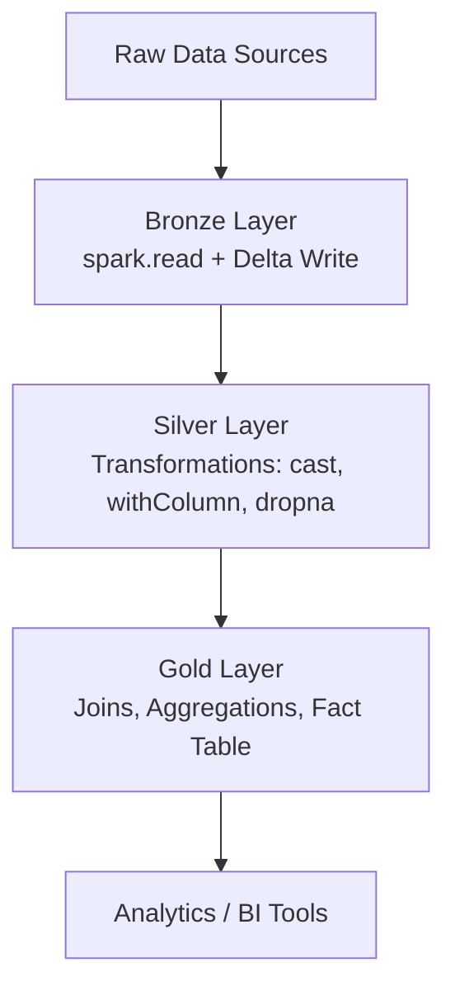

# E-Commerce-Data-Analysis---Azure-Data-Engineering


---

# **Azure Databricks ETL Pipeline (Bronze → Silver → Gold)**

A production-style ETL pipeline built on **Azure Databricks** using **PySpark** and **Delta Lake**, following the **Medallion Architecture** to ingest, clean, transform, and prepare data for analytics.

---

## **Architecture Overview**

```
                 +----------------------+
                 |  Raw Source Files    |
                 +-----------+----------+
                             |
                             v
                  (Bronze Layer - Raw)
                 +----------------------+
                 | spark.read()         |
                 | Delta Lake Storage   |
                 +-----------+----------+
                             |
                             v
               (Silver Layer - Cleaned Data)
                 +----------------------+
                 | withColumn(), cast() |
                 | dropna(), selectExpr |
                 +-----------+----------+
                             |
                             v
               (Gold Layer - Fact Table)
                 +----------------------+
                 | Joins, Aggregations  |
                 | Optimized Delta      |
                 +-----------+----------+
```

### **Mermaid Architecture Diagram**



---

## **Technologies Used**

* Azure Databricks
* PySpark (DataFrame API)
* Delta Lake (ACID transactions, schema enforcement, versioning)
* Medallion Architecture (Bronze/Silver/Gold)
* DBFS / Cloud Storage

---

## **Project Structure**

```
├─ notebooks/
│   ├─ Bronze_Layer.ipynb
│   ├─ Silver_Layer.ipynb
│   ├─ Gold_Layer.ipynb
│
├─ data/
│   ├─ raw/          <-- Bronze input
│   ├─ cleaned/      <-- Silver output
│   ├─ analytics/    <-- Gold tables
│
├─ README.md
└─ requirements.txt (optional)
```

---

## **Pipeline Flow Summary**

### **1. Bronze Layer — Raw Ingestion**

* Ingest source files using `spark.read()`.
* Apply cloud filesystem configs.
* Store raw data as Delta tables (`write.format("delta")`).

### **2. Silver Layer — Cleaning and Standardization**

* Transform raw data using:

  * `withColumn()`
  * `cast()`
  * `DecimalType`
  * `dropna()`
  * `selectExpr()`
* Save cleaned, curated Delta tables.

### **3. Gold Layer — Business Aggregation**

* Join Silver tables into a consolidated fact table.
* Apply aggregations using `groupBy()`.
* Optimize output using Delta partitions and write optimizations.

---

## **Key Features**

* End-to-end ETL using PySpark and Delta Lake
* ACID-compliant storage with schema enforcement and versioning
* Modular Bronze → Silver → Gold architecture
* Scalable for larger datasets and enterprise analytics workflows

---

## **How to Run This Project**

1. Clone the repository:

   ```bash
   git clone <your-repo-url>
   ```
2. Import the notebooks into Azure Databricks.
3. Upload or mount raw data in DBFS/external storage.
4. Execute the notebooks in order:

   * Bronze_Layer.ipynb
   * Silver_Layer.ipynb
   * Gold_Layer.ipynb
5. Query the Gold tables using Databricks SQL or external BI tools.

---

## **Future Improvements**

* Add CI/CD using GitHub Actions and Databricks CLI
* Create automated Jobs for Bronze ingestion
* Implement OPTIMIZE and Z-Ordering for faster queries
* Add PySpark unit tests for all transformations

---

## **Contributions**

Pull requests and suggestions are welcome.


